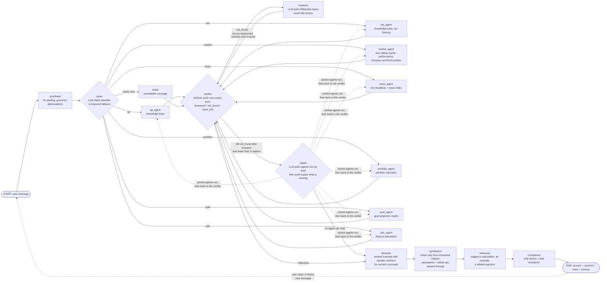

# Finnie — AI Finance Assistant (draft: frontend + database)

This draft covers the **React frontend**, a **FastAPI backend** and the **SQLite database**. The AI pieces (LangGraph workflow, agents, FAISS RAG, live market providers) are not built yet —
chat currently routes with the keyword router and returns a placeholder answer, and market data is bundled sample data.

## Run

One command starts both servers (backend :8000, frontend :5173); Ctrl+C stops both:

```bash
./dev.sh
```

Manual setup, if you prefer separate terminals:

```bash
# backend (Python 3.11+)
python -m venv .venv && source .venv/bin/activate
pip install -r requirements.txt
python -m scripts.seed_db            # creates finnie.db, seeds glossary + KB metadata
uvicorn src.api.main:app --reload    # http://localhost:8000/docs

# frontend (Node 18+)
cd frontend && npm install && npm run dev   # http://localhost:5173 (proxies /api -> :8000)

pytest                                # backend tests
```

## Layout
| Path | Purpose |
|---|---|
| `src/db/` | SQLAlchemy models: sessions, profiles, messages, portfolios/holdings, goals, market_cache, kb_documents, glossary_terms |
| `src/core/` | config, deterministic calculators (portfolio metrics, goal projection), cached market service |
| `src/workflow/` | keyword intent router (fallback; LangGraph router comes in M5) |
| `src/api/` | FastAPI app + routers under `/api` |
| `frontend/` | React app: Portfolio, Market, Research, Live, Goals tabs, a chat dock + profile sidebar |
| `src/rag/` | knowledge-base cleaning, section chunker, Qdrant build and search |
| `src/data/` | sample portfolios, mock market data, knowledge-base articles (Markdown + front-matter), raw Wikipedia pages |

The knowledge-base vector index is a local Qdrant collection (`finnie_kb`; see
[RAG data design](mds/rag-data-design.md)); SQLite only stores article metadata. Build or rebuild it with:

```bash
python -m src.rag.build_index        # fetches the pages of rag.categories (config.yaml), chunks them (max 250 tokens), indexes into src/data/qdrant/
```

Indexed so far: `basics`, `bonds`, `stocks` and `etfs-and-mutual-funds` (300 pages, 5,717 chunks); each category is added after its own token stats and
retrieval test (see [mds/](mds/README.md)). The Q&A and tax agents answer from this index and cite the exact section;
for topics not indexed yet (best match below `rag.min_score`) they fall back to a live Wikipedia lookup. Stop the app
before rebuilding: local Qdrant allows only one process at a time.

## Portfolio tab

The user's holdings and one report on them (`GET /api/sessions/{id}/portfolio/analysis`), computed in Python with no LLM.
The Portfolio agent answers chat questions from the same functions, so the tab and the chat give the same numbers. Details
and limits of each metric are in [Portfolio agent: data needs](mds/agent-portfolio-agent.md).

**What the user enters** (`GET` / `PUT /api/sessions/{id}/portfolio`; typed into the table, uploaded as a CSV with the
columns `ticker, shares[, cost_basis, purchase_date]`, or loaded from the balanced or tech-heavy sample):

| Field | Required | Used for |
|---|---|---|
| Ticker | yes | Price, asset type, sectors and fees. `CASH` (or a money-market fund such as `SPAXX`) counts at $1 a share |
| Shares | yes, above 0 | Value of the holding |
| Cost basis / share | no | Gain / loss and total return. Without it those show "n/a" for the holding |
| Purchase date | no | The day performance starts counting the holding. Left empty, the field shows `01-01-2026` and that date is used (`portfolio.default_purchase_date` in `config.yaml`) |

**Where the market data comes from** (the cached market service: Yahoo through yfinance, with the bundled sample
instruments as the offline fallback; `src/core/portfolio_data.py`):
- *Price and previous close*: the quote of each holding. The "Prices" badge shows the least fresh quote used.
- *Asset type, sectors and fees*: the bundled record when there is one, otherwise the Yahoo fund profile (what the fund
  mostly holds decides whether it is a bond, cash, real estate, international, thematic or broad stock fund), otherwise
  the stock profile. A ticker that cannot be priced or classified is skipped and listed in a warning.
- *Daily closes*: for each holding and the benchmark (`portfolio.benchmark`, the S&P 500), going back to the earliest
  purchase date, 10 years at most.
- *Dividends*: the payments of the last 12 months from each holding's stock profile.

**What the report shows** (`analyze_portfolio` and `portfolio_performance` in `src/core/calculators.py`):
- *Summary cards*: total value; total return (value against cost basis, for the holdings that have one); today's change
  (each holding against its previous close, the total weighted by value); diversification score out of 100 (up to 40
  points for the effective number of holdings, 30 for how many of the five asset classes are present, 30 for no single
  equity sector dominating); risk level from 1 to 5 (the value-weighted average of a fixed score per asset type, cash 1
  to individual stocks 5); yearly fees (value × expense ratio).
- *Warnings*: a holding above 20% of the portfolio, an expense ratio above 0.5%, an equity sector above 40% once fund
  holdings are included, a risk level above the profile's risk tolerance, no international exposure, skipped tickers.
- *Performance vs the S&P 500*: return since the start date, annualized return, volatility, max drawdown, Sharpe and
  Sortino ratios (risk-free rate from `portfolio.risk_free_rate`), and a chart of the portfolio's value against the same
  money put into the index on the same dates. Returns are time-weighted, so a purchase adds to the value without counting
  as a gain. Each holding counts from its purchase date, or from its own first close when that is later (a recent
  listing does not hold the others back); the note under the chart names the holdings this applies to. Under 30 trading
  days only the period return and drawdown are shown.
- *Top winners and losers*: three each, by return on cost basis when any holding has one, otherwise by today's move.
- *Dividend income*: the last 12 months of payments per share × current shares, by month, with the yield on today's value.
- *Allocation, sector and geographic exposure*: by asset class; by sector, looking through funds to their sector weights;
  and by US stocks / international stocks / bonds / cash, approximated from the asset type (a single stock counts as US).
- *Holdings table*: value, allocation, today's change and gain / loss per holding, with a total row.

There is no transaction history: each holding has one purchase date and one average cost basis for all its shares.

## Research tab

Two sub-tabs, both fed by yfinance (see the [yfinance library reference](mds/yfinance-capabilities.md)) through the cached
market service, with the bundled sample instruments as the offline fallback. Every figure has a one-line beginner
explanation, "Ask Finnie about X" sends the ticker to the chat, and "—" marks anything Yahoo doesn't report.

**Fund research** (`GET /api/market/fund/{symbol}`, yfinance `funds_data`, cached for a day) looks inside an ETF or mutual
fund (VOO, QQQ, BND, VFIAX…): category and fund family, expense ratio and turnover against the category average, total
assets, yield, the mix of stocks / bonds / cash, sector weights, top 10 holdings, the valuation of the stocks it holds
(P/E, P/B, P/S, P/CF) and, for bond funds, maturity, duration, share in government bonds and credit ratings. A stock or
index gets "AAPL is a stock, not a fund".

**Stock research** (`GET /api/market/stock/{symbol}`, cached for 6 hours; ~15 Yahoo requests fetched in parallel) covers a
company in three sections:
- *Earnings & estimates*: next report date with the expected EPS and revenue ranges, the next dividend and ex-dividend
  dates, the earnings track record (estimate vs reported, surprise, "beat in N of the last N"), analysts' EPS and
  revenue estimates for this and next quarter and year, how the EPS estimate moved over 90 days, up / down revisions,
  and expected growth against the S&P 500.
- *Financial statements*: the key lines of the income statement, balance sheet and cash flow (annual, quarterly or
  trailing 12 months; Yahoo has no TTM balance sheet), with a chart of the two headline lines and a tooltip per line.
- *Dividends & splits*: dividends per share by year (the current year marked "so far"), recent payments, shares
  outstanding over 5 years (falling = buybacks), stock splits and, for funds, capital gains distributions.

A fund entered here shows only its dividends, splits and capital gains, with a pointer to Fund research; an index gets
"no company data to research".

Yahoo's raw values are corrected before they are shown (`_fund_payload` and `_stock_payload` in
`src/core/market_service.py`). The fund valuation ratios arrive inverted (VOO's "P/E" is 0.040, i.e. 24.8). "Total Net
Assets" is unreliable, so total assets come from `info`, covering every share class. "US government" is the share in
government bonds, not a credit rating. A turnover of exactly 0 means "not reported". Earnings surprises come in percent
from one endpoint and as a fraction from another, so both are made fractions.

## Design notes

Decision records live in [`mds/`](mds/README.md):

- [RAG data design](mds/rag-data-design.md): how the knowledge base is stored (collection → category → document →
  section → chunk), why Qdrant over FAISS, and why each section is one chunk (never merged; split only above 250 tokens).
- [Knowledge-base token statistics: basics](mds/kb-token-stats-basics.md): token counts per document, section and
  paragraph for the 50 `basics` pages, plus retrieval and answer-quality tests comparing 512- and 250-token chunk limits.
  Regenerate with `python -m scripts.kb_token_stats` and `python -m scripts.eval_retrieval`.
- [Knowledge-base token statistics: bonds](mds/kb-token-stats-bonds.md): the same for the 50 `bonds` pages.
- [Knowledge-base token statistics: stocks](mds/kb-token-stats-stocks.md): the same for the 150 `stocks` pages.
- [Knowledge-base token statistics: etfs-and-mutual-funds](mds/kb-token-stats-etfs-and-mutual-funds.md): the same for the 50 `etfs-and-mutual-funds` pages (tested and indexed).
- [Evaluation summary](mds/kb-eval-summary.md): retrieval and answer-quality results for every tested category, and
  combined. Category docs and the summary are generated by `python -m scripts.kb_report`.
- [Ticker directory](mds/ticker-index.md): every US-listed stock and ETF (symbol + company name) so names, mistyped tickers
  ("NUU" → NU) and misspelt companies ("nvdia") resolve without Yahoo. Refresh with `python -m src.rag.build_tickers`.
- [yfinance library reference](mds/yfinance-capabilities.md): what the `yfinance` library (our Yahoo Finance data
  source) can fetch, checked live against version 1.7.0: per-ticker data, ETF/fund holdings, sectors, market summary,
  calendars and screeners; what the app uses today and candidate additions.
- [Agent code map](mds/agent-code-map.md): where each agent and workflow step lives in the code (function, file, helpers),
  and the steps to add a new node.
- [Agent tools](mds/agent-tools.md): which tools each agent calls and the data source behind each tool.

## Chatbot orchestrator (LangGraph)



Which tools each agent calls, and the data source behind each tool, are mapped in [Agent tools](mds/agent-tools.md). Where each agent lives in the code (function, file, helpers) is in [Agent code map](mds/agent-code-map.md).

The router can pick several agents for one question; they run in parallel. If no intent matches, it falls back to
`qa_agent`; `clarify` runs only when it is the sole intent (`route_after_router` in `src/workflow/nodes.py`).

- **Proofread** (`proofread_node` in `nodes.py`): with an LLM, rewrites the message with spelling, grammar and
  abbreviations fixed ("tsla last 10 yrs" → "TSLA over the last 10 years"), and turns a follow-up into a complete question
  from the conversation context ("compare to starbucks" → "Compare TSLA and Starbucks over the last month"). A rewrite that
  drops a number or ticker, or adds a company or number that is in neither the message nor the context, is discarded.
  Every later node reads the corrected `question`; `original_question` keeps what was typed (the chat stores the original).
  Without an LLM the message passes through and a follow-up is recognised by its wording.
- **Conversation context** (`src/workflow/context.py`): each answer is saved with what the turn used, in `messages.context`:
  the corrected question, its intents, the companies, the period and the figures the agents reported (prices, period
  returns). The next turn starts from it: proofread completes the follow-up with it, the router adds the earlier companies
  ("which did better?", "compare to X"), the market agent reuses the period, and the calculator is given the figures
  ("if SBUX rose 2%" uses the quoted price). A message that isn't a follow-up starts afresh, except a calculation, which
  keeps the subject.
- **Router** (`src/workflow/router.py`, `nodes.py`): LLM intent classifier when a model is connected, keyword/regex
  fallback otherwise. "What should I consider / how does X work" questions go to Q&A; Goal Planning is for savings
  projections with amounts and years.
- **Companies in market and news questions** are resolved once, by the router, with the recent conversation (`entities["companies"]`):
  the LLM corrects misspellings ("nvdia" → NVIDIA) and resolves "them" / "the same sector" to the company discussed earlier,
  then Yahoo maps the name to a ticker. A price question that names nothing we can identify asks which company is meant
  (it does not fall through to Wikipedia). News about "the same sector / industry / peers" shows live headlines for the
  largest companies in the company's Yahoo industry (`industry_peers` in `src/core/market_service.py`).
- **Agents** report a status with their output: `answered`, `not_found` (nothing usable yet) or `need_info` (a
  follow-up question for the user). They are wrapped so a failure is recorded in state and the other agents still
  answer. Q&A and tax search the knowledge base (Qdrant, `src/rag/`); market concepts without a ticker are `not_found`
  so research looks them up.
- **Verifier** rechecks every output before anything is written. It runs again after research and after each replan
  round, but checks each output only once:
  - a knowledge-base answer whose chunks don't actually answer the question (LLM check) becomes `not_found` and goes to
    research;
  - a **researched** (Wikipedia) answer gets the same check. If it doesn't answer either, the output stays `not_found`,
    the check's note on what is missing is kept for replan, and the research is kept aside as a last-resort fallback;
  - a `need_info` follow-up gets 2–3 clickable **choices**, written as messages the user would send (for example
    "I want to save $20,000 for a house in 3 years").
- **Replan** (the loop back to the agents): when an output is still `not_found` after research, the LLM is told which
  agents already ran and what is missing, and picks agents **not yet tried** that could supply it (for example Q&A
  found only what an ETF is, so it hands "popular ETFs and their performance" to News). The picked agents run in
  parallel and report back to the verifier. If it picks Market or News and no company was resolved yet, it resolves
  one the way the router does. It runs at most `workflow.max_replans` times per question (3, in `config.yaml`), never
  re-runs an agent, and is skipped without an LLM. When no agent can help, the answer is written from whatever was
  found; if nothing answered at all, from the research the verifier found incomplete, and the reply says what it
  couldn't cover.
- **Calculator** (`src/workflow/calc.py`, maths in `src/core/calculators.py`): the LLM picks one calculation and
  extracts the user's numbers (a keyword fallback covers growth and doubling time without an LLM); Python computes the
  result, so figures are exact. Available: growth of a lump sum and/or monthly deposits, present value, loan or
  mortgage payment, doubling time (Rule of 72 vs exact), real return after inflation, purchasing power after
  inflation, APY from APR, bond current yield. The reply shows the inputs, formula and result, and is passed through word for word. Missing numbers → it
  asks, with example choices. "How much should I save each month to reach $X" stays with Goal Planning.
- **Illustrate**: conceptual answers about numeric topics come with a worked example straight away, without being asked.
  The LLM picks the fitting calculation and sample numbers (compound interest → growth of $10,000 at 6% over 10 years;
  mortgages → a loan payment; inflation → purchasing power; APY → APY from APR …), and the Calculator computes it
  exactly. It's shown under "Example with sample numbers". Non-numeric topics (e.g. what a green bond is) get none. To
  go deeper, the follow-up suggestions offer the same calculation with different numbers.
- **Research** handles `not_found`: the LLM names Wikipedia concept articles (once per pass, shared by every agent
  being researched), each fetched by exact title (a search is used only if the title doesn't exist, and a result must
  share a word with it). Without an LLM, the router's keyword query is searched. What it finds goes back to the verifier.
- **Synthesizer** writes the reply from `answered` outputs only and may not add facts of its own; if something wasn't
  covered it says so. Follow-up questions and "couldn't find" messages are passed through unchanged. **Compliance**
  removes advice-like sentences and appends the disclaimer.
- **Follow-ups**: after a real answer, the followups node suggests up to three next questions: a worked calculation
  with example numbers (which goes to the Calculator when clicked), a request for a real-life example, and a related
  concept. They must be questions in the user's voice; anything else is dropped. This costs one extra LLM call per answer.
- **Choices** (follow-ups, or the options offered when more details are needed) appear as buttons under the reply; a
  click sends the choice as the next message, so it is routed again from the start.
- **Agent flow panel**: a dock fixed to the bottom of the screen shows the graph working on each question. `POST
  /api/sessions/{id}/chat/stream` runs the same graph as `/chat` but streams newline-delimited JSON: a `node_start` /
  `node_end` event per LangGraph node (from `stream_chat` in `src/workflow/graph.py`; parallel agents overlap), then the
  stored reply. The panel (`frontend/src/components/AgentFlow.tsx`) lights the running node, ticks finished ones with
  their time and status (answered / not found / needs info / failed), and dims agents the router (or a replan round) didn't
  pick. A node that ran more than once in the loop shows a count (Verifier ×3). Lines between the nodes are the compiled
  graph's own edges (`GET /api/chat/flow`): the path a question took turns green (blue and dashed while it's in
  progress), worked out from the order the nodes actually ran. A skipped step is bypassed visibly (Verifier → Illustrate
  curves under Research and Replan), and the loops back (Research → Verifier, Replan → agents) arc over the top. The panel's height is
  adjustable: drag the handle on its top edge (or focus it and use ↑/↓), double-click it or press Hide to collapse. The
  diagram zooms with the height (up to 2.5×, scrolling sideways once it is wider than the screen), and the size is remembered. A− / A+ in the panel header change the text size inside the diagram (50–150%,
  default 85%) and − / + under "Boxes" change the size of the squares (60–200%, default 100%); the two are independent of each other and of the panel's zoom. Click a percentage to reset it; both are remembered. Nodes stay
  lit at least ~0.3 s so instant steps (basic mode) are still visible, and the answer appears once the panel has caught
  up. Node layout comes from `GET /api/chat/flow`; `tests/test_flow.py` keeps it in step with the graph.
- Every reply stores a **trace** ("How I answered" in the UI), the agents used, source citations and any choices.

**Without an API key** the chat runs in *basic mode*: excerpts from Wikipedia plus the calculators. To enable full AI answers put one key in `.env` (see `.env.example`) and install that provider's package:

| Key | Package |
|---|---|
| `ANTHROPIC_API_KEY` | `pip install langchain-anthropic` |
| `OPENAI_API_KEY` | `pip install langchain-openai` |
| `GOOGLE_API_KEY` | `pip install langchain-google-genai` |

`llm.provider: auto` in `config.yaml` uses the first provider whose key is set. Knowledge-base ingest from Wikipedia: `python -m src.kb.ingest --dry-run`.
