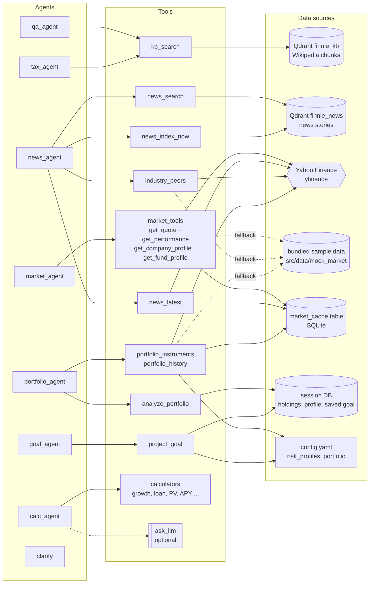
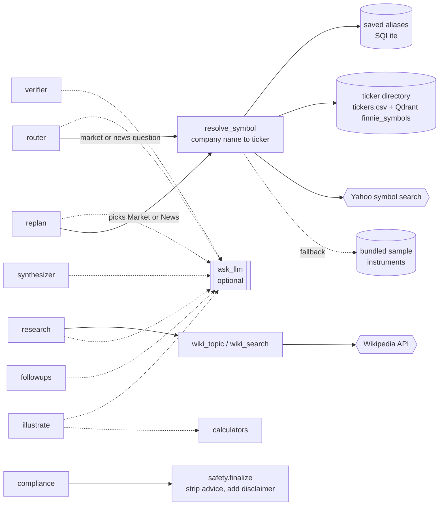

# Agent tools

Which tool each node of the chat workflow ([README: Chatbot orchestrator](../README.md#chatbot-orchestrator-langgraph)) calls,
and what each tool reads. Tools live in `src/workflow/tools.py` (and `src/core/`); the nodes that call them are in
`src/workflow/nodes.py`.

Legend: solid arrow = always used when the agent runs; dotted arrow = optional (only with an LLM connected, or only on a
fallback path). The LLM is a single shared dependency (`ask_llm` in `src/core/llm.py`) and is optional everywhere: without a key every
node has a keyword or extractive fallback.

## Agents

`clarify` has no tools: it returns a fixed "please rephrase" message with starter choices.

| Agent | Tools | Notes |
|---|---|---|
| `qa_agent` | `kb_search` | Best chunk below `rag.min_score` (or the index is missing) → `not_found`, so **research** looks the topic up on Wikipedia |
| `tax_agent` | `kb_search` | Same as Q&A, with "tax" added to the query and a tax caveat in front of the answer |
| `market_agent` | `get_quote`, `get_performance`, `get_company_profile`, `get_fund_profile` (`src/workflow/market_tools.py`) | Tickers come from the router (see below), the previous answer's context, or the UI's watchlist / selected stock. With an LLM the model picks the tools and arguments (tool calling, at most `workflow.market_tool_calls` = 4 per question); then, and without an LLM, every company gets a quote and the asked or carried period its performance. Every tool reads through the market cache with the sample-data fallback, and Python computes all figures. Results go to `state["market_data"]` (read by the synthesizer) and key figures to the saved context. A concept with no ticker → `not_found` → research |
| `news_agent` | `news_latest`, `news_search`, `news_index_now`, `industry_peers` | Fetches live headlines, indexes them, then searches the news index for the topic and time window; "same sector" questions use `industry_peers` to get peers first |
| `portfolio_agent` | `portfolio_instruments`, `analyze_portfolio`, `portfolio_history` | Holdings come from the session; prices, asset type, sectors and fees from the market service (quote, fund and stock endpoints; bundled instruments as fallback); performance against the `portfolio.benchmark` index (S&P 500) from daily closes, counting each holding from its purchase date (`portfolio.default_purchase_date`, 2026-01-01, when it has none) or from its own first close when that is later, so a recent listing does not hold the others back. No LLM: the answer is a fixed template filled with the computed figures. The Portfolio tab's report (`GET /portfolio/analysis`) runs the same functions plus `portfolio_dividends`. See [agent-portfolio-agent.md](agent-portfolio-agent.md) |
| `goal_agent` | `project_goal` | Return assumption from `config.yaml` `risk_profiles`; uses the plan saved on the Goals tab for "am I on track?" |
| `calc_agent` | calculators (`src/core/calculators.py`) | The LLM only picks the function and extracts the numbers (keyword fallback without one); Python computes the result |

## Pipeline steps

The router and the steps after the agents use tools too.

- **router**: the LLM classifies intent (keyword fallback). For market and news questions it also resolves company names once
  (`entities["companies"]`) so the market and news agents share the result.
- **verifier**: LLM check that knowledge-base chunks, and what research found, really answer the question (noting what
  is missing), and LLM-written clickable choices for `need_info`.
- **replan**: when an output is still `not_found` after research, the LLM picks agents not yet tried that could supply
  what is missing (at most 3 rounds). Like the router, it resolves company names when it picks Market or News.
- **research**: only runs when an agent returned `not_found`; the LLM names Wikipedia articles (`wiki_topic`), otherwise the
  router's keywords go to `wiki_search`.
- **illustrate**: with an LLM, picks a calculation and sample numbers for numeric concepts; the calculators compute it.
- **compliance**: pure Python, no LLM.
